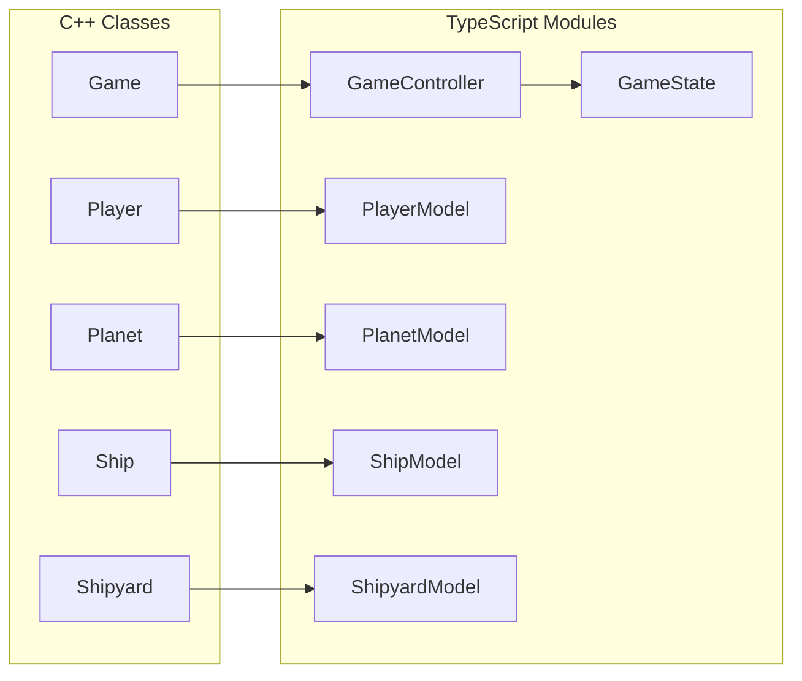
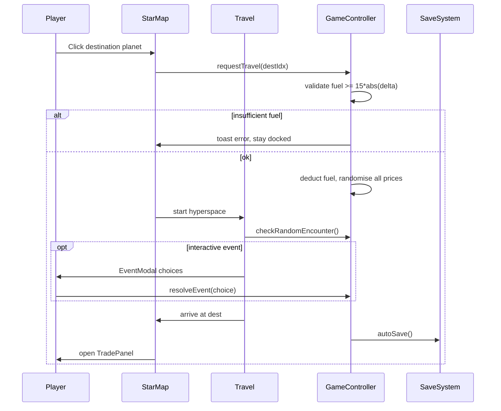

# Galactic Trader — Phaser 3 Web Port Plan

## Repo layout (first step before any game code)

Restructure per your choice:

```plaintext
GalacticTrader/
├── cpp/                          # existing C++ sources moved here unchanged
│   ├── main.cpp, Game.cpp, ...
│   └── README-cpp.md             # brief pointer to original console build
├── src/                          # Phaser + TS (new)
├── public/assets/                # sprites, fonts, audio placeholders
├── index.html
├── vite.config.ts
├── tsconfig.json
├── package.json
└── README.md                     # updated for web build + CrazyGames notes
```

The C++ code in [`Game.cpp`](Game.cpp), [`Player.cpp`](Player.cpp), etc. becomes the **logic spec** — not called at runtime.

---

## 1. File / folder structure

```plaintext
src/
├── main.ts                       # Phaser.Game bootstrap, scene registration
├── game/
│   ├── constants.ts              # BASE_FUEL_COST=15, FLAT_TOLL=200, DERELICT_FUEL=5
│   ├── GameState.ts              # single source of truth + getters
│   ├── GameController.ts         # orchestrates travel/trade/encounters (replaces Game::run)
│   ├── models/
│   │   ├── Player.ts             # credits, fuel, inventory, shipRegistry
│   │   ├── Planet.ts             # name, prices[3], randomisePrices()
│   │   ├── Ship.ts               # type, maxFuel, maxCargo, damageCost
│   │   └── Shipyard.ts           # catalog + buy/equip/repair validation
│   ├── systems/
│   │   ├── TravelSystem.ts       # fuel calc, price refresh, game-over check
│   │   ├── TradeSystem.ts        # buy/sell validation + execution
│   │   ├── EncounterSystem.ts    # checkRandomEncounter + all 5 handlers
│   │   ├── SaveSystem.ts         # serialize/deserialize, CrazyGames + localStorage
│   │   └── RandomSystem.ts       # uniformInt(min,max) — mirrors C++ distributions
│   └── data/
│       ├── planets.ts            # names, indices 0–4, map coords, biome/sprite keys
│       └── shipCatalog.ts        # Rusty Scout / Cargo Hauler / Falcon Scout specs
├── scenes/
│   ├── BootScene.ts              # scale config, SDK init, scene routing
│   ├── PreloadScene.ts           # asset loading + CrazyGames loading bar
│   ├── TitleScene.ts             # captain name input, New Game / Continue
│   ├── StarMapScene.ts           # primary gameplay scene
│   ├── TravelScene.ts            # hyperspace animation + encounter dispatch
│   └── GameOverScene.ts          # 0 credits + 0 cargo + 0 fuel
├── ui/                           # Phaser Container-based components (not separate scenes)
│   ├── HudBar.ts                 # credits, fuel, cargo, ship name — always visible
│   ├── TradePanel.ts             # buy/sell tabs when docked
│   ├── ShipyardPanel.ts          # buy/equip + repair tab (inside dock UI)
│   ├── EventModal.ts             # pirate/salvage/alien merchant choices
│   ├── ToastQueue.ts             # feedback messages (replaces std::cout)
│   └── SavedIndicator.ts         # brief "Saved" flash after auto-save
├── entities/
│   ├── PlanetNode.ts             # clickable planet sprite + label + fuel-cost tooltip
│   ├── RouteLine.ts              # decorative lines between planets (visual only)
│   └── ShipIcon.ts               # player ship marker + travel tween
├── sdk/
│   └── CrazyGamesBridge.ts       # init, loading, data API, rewarded ad wrapper
└── utils/
    ├── clamp.ts
    └── format.ts                 # "1,200 Star Coins" helpers
```

**Design choice:** Trade and Shipyard are **UI panels inside `StarMapScene`**, not separate Phaser scenes. This avoids scene-stack churn during the core loop and matches "click planet → dock → trade" flow. `TravelScene` is the only mid-loop scene transition.

---

## 2. Game state mapping (C++ → TypeScript)



### `GameState` shape

| Field | C++ source | Default / notes |
|-------|-----------|-----------------|
| `player.name` | `Player::name` | Prompt on TitleScene |
| `player.credits` | `Player::credits` | 1000 |
| `player.fuel` | `Player::fuel` | 100 |
| `player.inventory[0/1]` | `inventory[0/1]` | Iron / Water, both 0 |
| `player.shipRegistry` | `ship_registry` map | Rusty Scout=true, others false |
| `ship.type` | `Ship::ship_type` | "Rusty Scout" |
| `ship.maxFuel` | `Ship::max_fuel` | from catalog |
| `ship.maxCargo` | `Ship::max_cargo` | may be reduced by debris (`del_cargo_slots`) |
| `ship.damageCost` | `Ship::damage_cost` | 0 until unpaid debris repair |
| `planets[i].name` | `Planet::name` | Tatooine, Coruscant, Hoth, Endor, Naboo |
| `planets[i].prices[0/1/2]` | `prices[0/1/2]` | Iron / Water / Fuel |
| `planets[i].index` | array index `i` | **used for fuel formula only** |
| `currentPlanetIdx` | `curr_planet_idx` | 0 on new game |
| `constants.baseFuelCost` | `BASE_FUEL_COST` | 15 |
| `constants.flatToll` | `FLAT_TOLL` | 200 |
| `constants.derelictFuel` | `DERELICT_FUEL` | 5 |

### Logic modules (1:1 port targets)

| C++ function | TS module | Preserve exactly |
|--------------|-----------|------------------|
| `Planet::randomise_prices()` | `PlanetModel.randomisePrices()` | Iron 50–120, Water 20–80, Fuel 30–100 |
| Travel fuel | `TravelSystem.calcFuelCost(from, to)` | `15 * abs(to - from)` |
| `market_menu` buy/sell | `TradeSystem` | credit/cargo/fuel capacity checks |
| `Shipyard::show_shipyard_menu` | `ShipyardModel` + `ShipyardPanel` | ownership, cost, cargo fit, fuel siphon |
| `Shipyard::repair_ship` | `ShipyardModel.repairShip()` | restore catalog maxCargo, clear damageCost |
| `check_random_encounter` | `EncounterSystem` | 65% safe; else 40/35/15/8/2% split |
| All `handle_*` events | `EncounterSystem` handlers | all rolls, penalties, choices |
| Game over | `TravelSystem.isGameOver()` | credits==0 && cargo==0 && fuel==0 |
| `save_game` / `load_game` | `SaveSystem` | same fields; JSON instead of `.txt` |

### Star map layout and fuel cost (confirmed addendum)

**Decision: option (b) — index-ordered layout, formula unchanged.**

- Fuel cost remains **purely index-based**: `15 * abs(toIndex - fromIndex)`. No graph edges, no Euclidean distance, no balance changes.
- Planet `(x, y)` positions in [`planets.ts`](src/game/data/planets.ts) are chosen so **visual distance correlates with index distance** — players reading the map won't feel misled.
- **Gate before StarMapScene:** finalize `planets.ts` coordinates first. Suggested layout (1280×720 canvas, ~Y=360 baseline):

| Index | Planet | Biome sprite | Approx (x, y) |
|-------|--------|--------------|---------------|
| 0 | Tatooine | desert | (160, 380) |
| 1 | Coruscant | city | (380, 300) |
| 2 | Hoth | ice | (640, 420) |
| 3 | Endor | forest | (860, 320) |
| 4 | Naboo | ocean | (1080, 400) |

- Route lines connect **adjacent indices only** (0–1, 1–2, 2–3, 3–4) as a visual "trade route" chain; longer jumps still animate ship along the chain path (or direct line) but cost stays index-based.
- **Any planet remains clickable** (same as C++ travel menu allowing any destination).
- Click **current planet** → open dock panel (replaces "already orbiting → market_menu").
- Click **other planet** → show fuel cost tooltip on hover (`15 × steps`); on confirm, run travel pipeline.
- Hover tooltip should display exact fuel cost so players see the number even if spacing isn't perfectly proportional.

### Save format (JSON, mirrors C++ `save_file.txt`)

```json
{
  "version": 1,
  "playerName": "...",
  "credits": 1000,
  "fuel": 100,
  "iron": 0,
  "water": 0,
  "shipType": "Rusty Scout",
  "currentPlanetIdx": 0,
  "shipRegistry": { "Rusty Scout": true, "Cargo Hauler": false, "Falcon Scout": false },
  "shipMaxCargo": 20,
  "shipDamageCost": 0
}
```

Note: C++ save does **not** persist market prices or reduced cargo from damage separately — on load, planets re-init with fresh random prices (`init_planets()`), and `shipMaxCargo`/`shipDamageCost` must be added to preserve debris penalties (explicit small extension documented in save schema).

---

## 3. Phaser scenes and responsibilities

| Scene | Responsibility |
|-------|----------------|
| **BootScene** | Responsive scale (`FIT` + center), detect CrazyGames iframe vs local dev, call `CrazyGamesBridge.init()`, route to Preload or Title |
| **PreloadScene** | Load placeholder pixel sprites + bitmap/UI font; drive CrazyGames loading API (0→100%); transition to TitleScene |
| **TitleScene** | Captain name text input; "New Game" (calls `GameController.initialise()`) / "Continue" (load save); validate non-empty name |
| **StarMapScene** | Starfield bg; 5 `PlanetNode`s + route lines; `HudBar`; click handling; docked `TradePanel` + `ShipyardPanel` tab; `SavedIndicator`; dispatches travel to TravelScene |
| **TravelScene** | Ship tween along route with engine-trail particles; calls `EncounterSystem.check()` mid-flight; shows `EventModal` for interactive events; on complete → return to StarMapScene at destination (optionally auto-open trade panel) |
| **GameOverScene** | Stranded message; Restart (clears save) / Return to Title |

**Persistent UI:** `HudBar` lives in StarMapScene (and optionally duplicated minimally in TravelScene for continuity).

**Event UI:** `EventModal` is a shared overlay used by TravelScene (not a separate scene) for salvage investigate/past, pirate pay/flee, alien merchant choices.

---

## 4. UI wireframe (core loop)



**Docked panel tabs:** Market (Buy / Sell) | Shipyard (Buy-Equip / Repair)

---

## 5. Art placeholders (pixel, drop-in ready)

All placeholders in `public/assets/sprites/` — flat colors + text labels, consistent sizes:

| Asset | Size | Notes |
|-------|------|-------|
| `ship_player.png` | 32×32 | Top-down ship icon |
| `planet_desert.png` | 48×48 | Tatooine |
| `planet_city.png` | 48×48 | Coruscant |
| `planet_ice.png` | 48×48 | Hoth |
| `planet_forest.png` | 48×48 | Endor |
| `planet_ocean.png` | 48×48 | Naboo |
| `ui_panel.png` | 9-slice 64×64 | Trade/shipyard chrome |
| `ui_button.png` | 9-slice 32×16 | Buttons |
| `particle_star.png` | 4×4 | Engine trail / click pulse |
| `icon_iron/water/fuel.png` | 16×16 | Commodity icons |

**Juice (phase 3):** engine trail during TravelScene tween; planet scale pulse on hover/click; camera shake on solar flare / pirate hit; red flash overlay on game-over trigger.

---

## 6. CrazyGames SDK integration (last phase)

### Phase 4 gate — verify docs before coding

**Do not implement [`CrazyGamesBridge.ts`](src/sdk/CrazyGamesBridge.ts) from memory.** Before writing integration code:

1. Read current official docs (as of build date):
   - [SDK Introduction](https://docs.crazygames.com/sdk/intro/)
   - [Data module](https://docs.crazygames.com/sdk/data/)
   - [Game module](https://docs.crazygames.com/sdk/game/)
   - [Video ads](https://docs.crazygames.com/sdk/video-ads/)
2. Confirm method names/signatures match docs — APIs changed between v2 and v3.
3. Add a short comment block at top of `CrazyGamesBridge.ts` citing doc URLs + date verified.
4. Test on `localhost` (SDK `local` environment) and CrazyGames preview tool before submission.

### Confirmed v3 HTML5 API surface (verify against docs at implementation time)

**Script tag** (in `index.html`, before game code):
```html
<script src="https://sdk.crazygames.com/crazygames-sdk-v3.js"></script>
```

**Init** (async, required before any other SDK call):
```ts
await window.CrazyGames.SDK.init();
```

**Environment check** (skip SDK calls when `disabled`):
```ts
window.CrazyGames.SDK.environment; // "local" | "crazygames" | "disabled"
```

**Loading lifecycle** ([game module](https://docs.crazygames.com/sdk/game/)):
```ts
window.CrazyGames.SDK.game.loadingStart();  // PreloadScene start
window.CrazyGames.SDK.game.loadingStop();   // PreloadScene complete → TitleScene
```

**Gameplay lifecycle** (pause audio/game during ads):
```ts
window.CrazyGames.SDK.game.gameplayStart();
window.CrazyGames.SDK.game.gameplayStop();
```

**Data module** ([data module](https://docs.crazygames.com/sdk/data/) — localStorage-compatible API):
```ts
window.CrazyGames.SDK.data.setItem(key, value);   // value is string
window.CrazyGames.SDK.data.getItem(key);          // string | null
window.CrazyGames.SDK.data.removeItem(key);
window.CrazyGames.SDK.data.clear();
```
- Debounced saves (~1s); 1MB limit per user.
- On CrazyGames: use Data module as **primary** save (guest data also goes through SDK localStorage). Enable "Progress Save via Data Module" in submission settings.
- Off-platform / `disabled` environment: fall back to raw `localStorage` with same key (`galactic-trader-save-v1`).

**Rewarded ad** ([video ads](https://docs.crazygames.com/sdk/video-ads/)):
```ts
window.CrazyGames.SDK.ad.requestAd("rewarded", {
  adStarted: () => { /* mute + pause */ },
  adFinished: () => { /* grant reward + resume */ },
  adError: (_error, _errorData) => { /* resume without reward */ },
});
```
- Optional button on TradePanel after successful sell — never forced mid-travel or mid-event.
- Call `gameplayStop()` before ad, `gameplayStart()` after ad finishes/errors.

### Integration map

| Hook | When |
|------|------|
| `SDK.init()` | BootScene / PreloadScene (await before data load) |
| `game.loadingStart/Stop` | PreloadScene asset load 0→100% |
| `game.gameplayStart/Stop` | StarMapScene active; stop during ads/modals |
| `data.setItem/getItem` | SaveSystem — primary on CrazyGames |
| `localStorage` fallback | `environment === "disabled"` or SDK absent |
| Auto-save trigger | After travel arrive, trade complete, shipyard transaction, event resolve |
| `SavedIndicator` | 1.5s fade toast — no manual save button |
| **Rewarded ad** | Optional post-sell bonus credits button |

No leaderboard in C++ spec — skip unless you add a score (= credits) later.

---

## 7. Dependencies to install

```json
{
  "dependencies": {
    "phaser": "^3.80.0"
  },
  "devDependencies": {
    "typescript": "^5.4.0",
    "vite": "^5.4.0"
  }
}
```

Optional later: `@types/node`, CrazyGames SDK script tag in `index.html` (loaded from their CDN per current docs).

---

## 8. Prioritized build order

### Phase 0 — Scaffold (day 1)
- Move C++ to `cpp/`, scaffold Vite + Phaser + TS at root
- `constants.ts`, `GameState`, model stubs, empty scenes wired in `main.ts`
- Responsive canvas config (1280×720 base, scales to iframe)

### Phase 1 — Core loop playable (days 2–4) **priority**
- **First:** finalize [`planets.ts`](src/game/data/planets.ts) with index-ordered `(x, y)` coordinates (addendum option b)
- Port `Player`, `Planet`, `Ship`, `Shipyard` models with exact validation logic
- `TravelSystem` + `TradeSystem` + index-based fuel
- `StarMapScene`: planet nodes on index-ordered path, click current = dock, click other = travel
- `TradePanel`: buy iron/water/fuel, sell iron/water
- `TitleScene` with name prompt; `SaveSystem` localStorage auto-save
- **Exit criteria:** travel between planets, prices change on jump, buy/sell works, game over detected

### Phase 2 — Full mechanic parity (days 5–7)
- Port `EncounterSystem` (all 5 events + nested rolls)
- `TravelScene` animation pipeline + `EventModal`
- `ShipyardPanel` tab (buy/equip/repair)
- Persist `shipMaxCargo` + `shipDamageCost` in save schema
- `GameOverScene`

### Phase 3 — Juice + polish (days 8–10)
- Placeholder pixel art pass, particles, hover pulse, shake/flash
- Toast queue, tooltips (fuel cost on hover), panel transitions
- Mobile-friendly hit areas + font scaling

### Phase 4 — CrazyGames SDK (days 11–12)
- **Gate:** read current SDK v3 docs; confirm all method signatures before coding
- Implement `CrazyGamesBridge.ts` against verified API (init, loadingStart/Stop, data, rewarded ad, gameplayStart/Stop)
- Migrate SaveSystem to `SDK.data` on CrazyGames; localStorage fallback off-platform
- Rewarded ad hook on optional post-sell bonus
- Test on localhost (`local` env) + CrazyGames preview tool; iframe smoke test at 800×600, 1024×768

---

## 9. Key constraints honored

- **No mechanic redesign:** all formulas, catalogs, encounter probabilities, and validation order copied from [`Game.cpp`](Game.cpp) / [`Shipyard.cpp`](Shipyard.cpp) / [`Planet.cpp`](Planet.cpp)
- **Map is presentation layer:** fuel stays index-based; planet positions laid out in index order so visual distance loosely matches cost (option b)
- **Shipyard stays docked trade tab** (C++ market option 3)
- **Captain name kept** on TitleScene
- **Save:** auto on meaningful actions + Saved indicator; CrazyGames data API primary

## 10. One documented save extension

C++ save omits `ship.maxCargo` after debris damage and `ship.damageCost`. The web port will add these two fields to JSON so hull damage persists correctly across sessions — behavior matches C++ within a single session but fixes an existing persistence gap.
